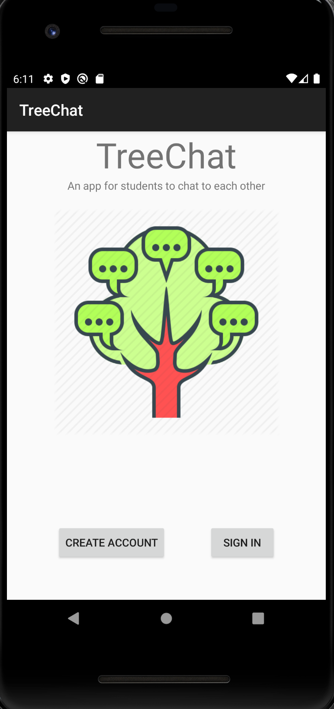
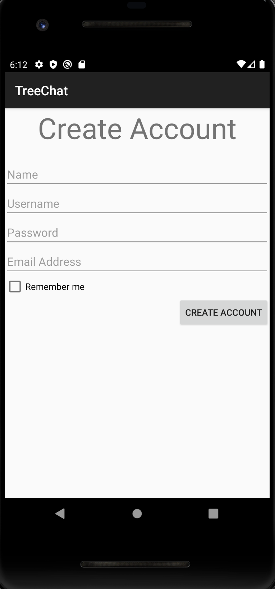
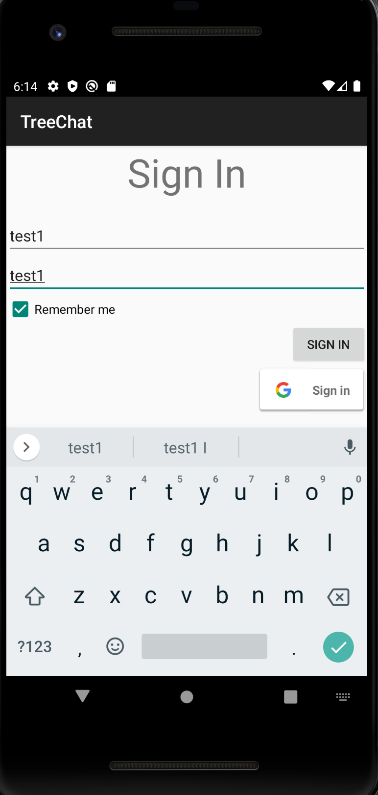
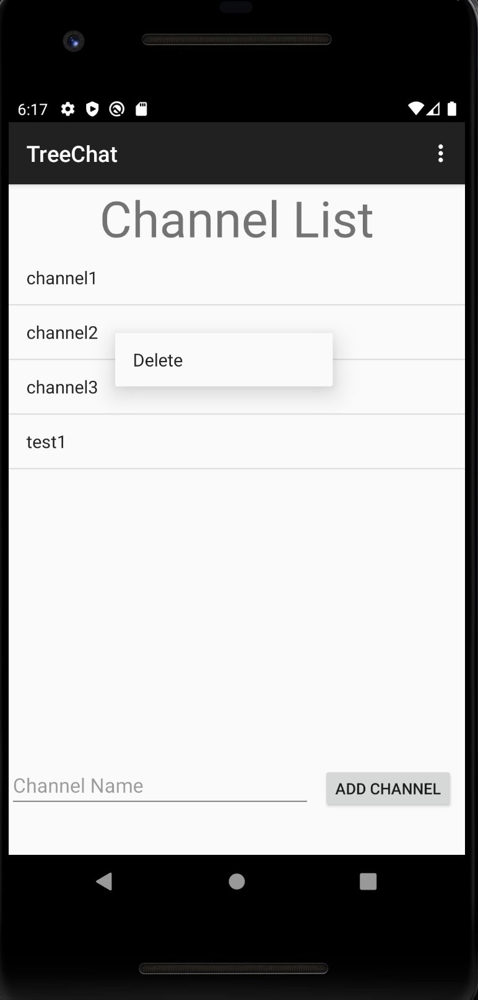
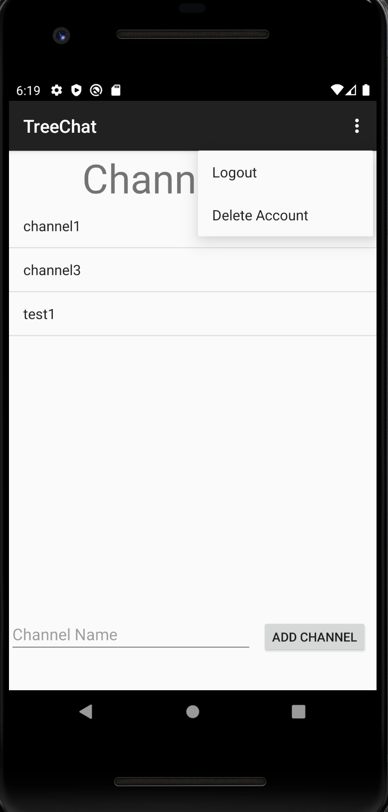
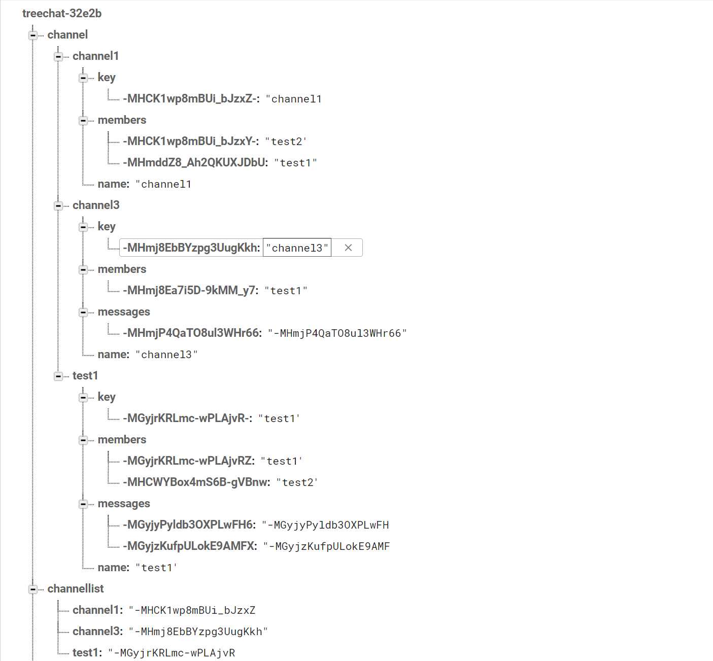
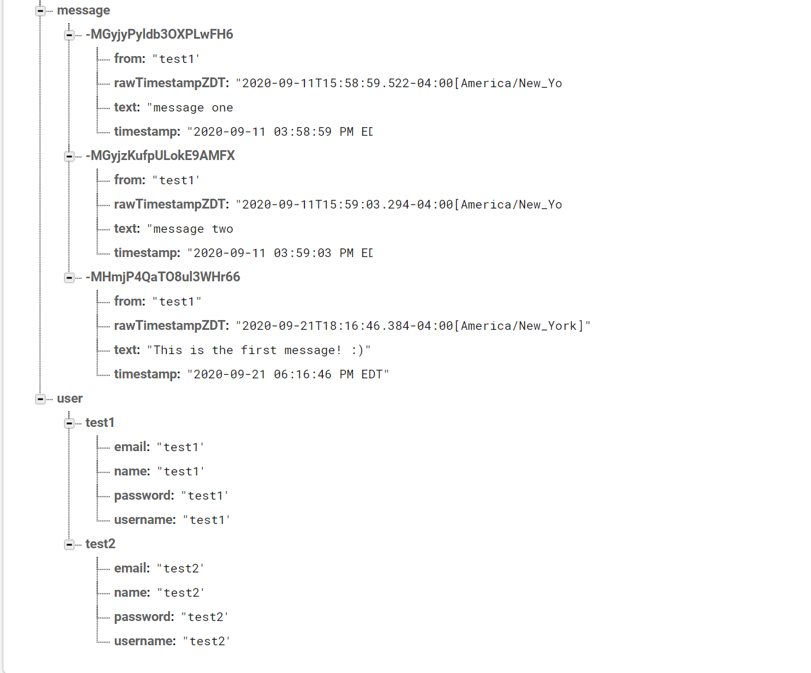

# TreeChat

This is a messaging app that students can use to login to their account, join channels and send messages with. This project features account login, account auto-login, account logout, account deletion, channel list selection, channel members, adding channel messages, and channel deletion.

### This is the welcome page:

### This is the create account page:

### This is the sign-in page:

### This is the channel list page, featuring adding channels:

### This is the channel page, where you can send messages:

### This is the channel list page, featuring deleting channels, logging out, and account deletion:

### Firebase database overview:

